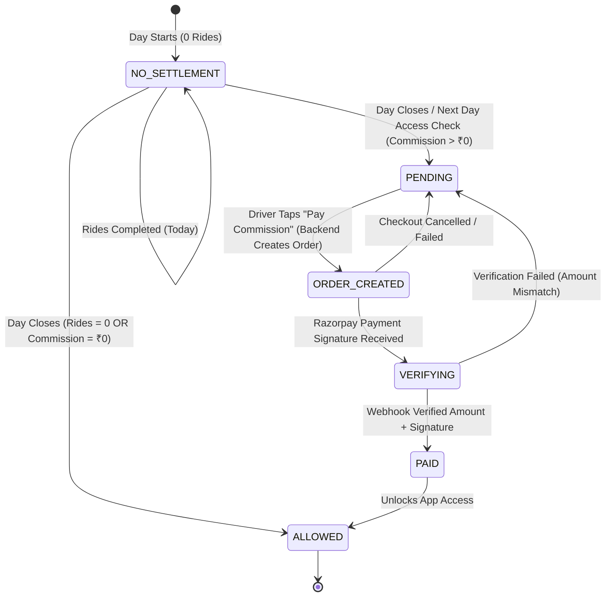
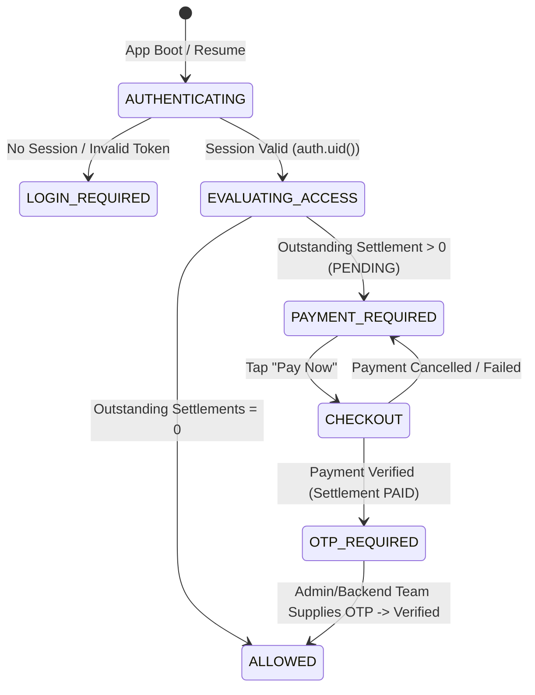
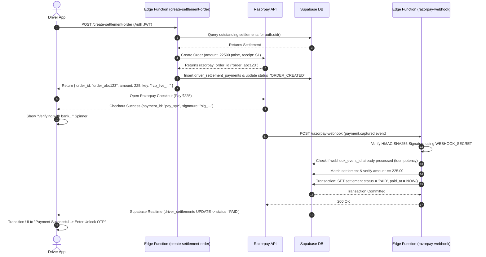
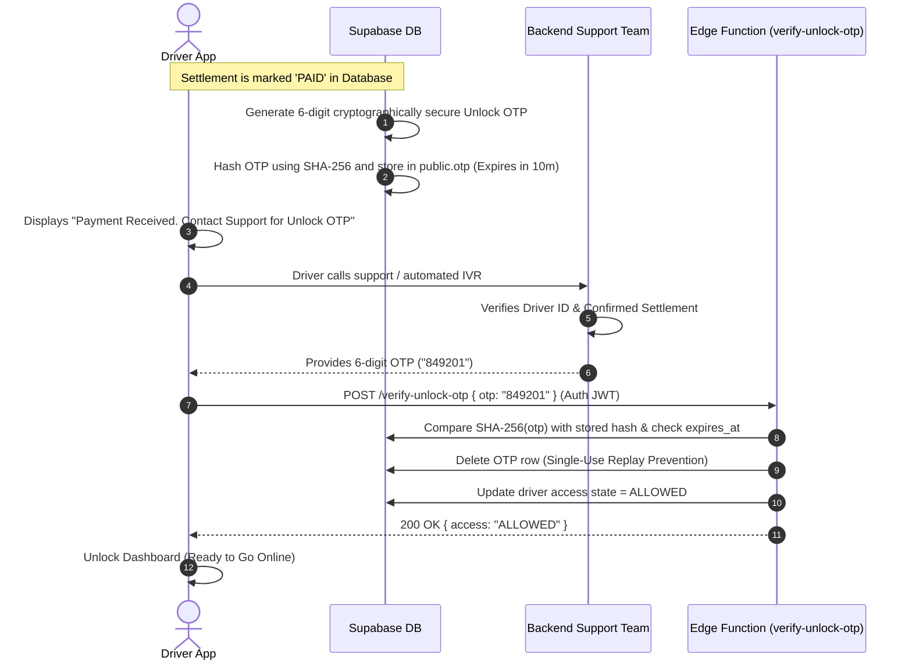

# QPARTNER — DRIVER COMMISSION, DAILY SETTLEMENT & RAZORPAY GATING BLUEPRINT
**Document Status:** Master Architecture & Security Blueprint (Pre-Implementation Verification)  
**Target Repository:** `d:\Quickora Delivery\QPartner` (Quickora Delivery Partner Application)  
**Scope:** Server-Authoritative Commission Calculation, Per-Ride Snapshotting, Daily Settlements, Razorpay Verification, and App Access Gating.

---

## SECTION A — EXISTING ARCHITECTURE EVIDENCE & AUDIT

Every finding below has been directly verified from the source code in `d:\Quickora Delivery\QPartner`:

### A.1 The Semantic Meaning of `driver_earnings.amount`
- **Code Reference:** [`services/driver.service.ts:145-151`](file:///d:/Quickora%20Delivery/QPartner/services/driver.service.ts#L145-L151) and [`app/(tabs)/profile.tsx:59-62`](file:///d:/Quickora%20Delivery/QPartner/app/(tabs)/profile.tsx#L59-L62).
- **Exact Line in Code:**
  ```typescript
  // services/driver.service.ts
  const driverAmount = Math.round(ride.fare * 0.8 * 100) / 100;
  await supabase.rpc('complete_driver_ride', {
      p_ride_id: rideId,
      p_driver_id: ride.driver_id,
      p_earnings_amount: driverAmount,
  });
  ```
- **Finding:**
  1. `ride.fare` represents the **Gross Customer Fare**.
  2. `driver_earnings.amount` currently stores **Net Driver Payout (80% of fare)**.
  3. The 20% platform commission was hardcoded on the client side (`ride.fare * 0.8`) with zero commission rate or commission amount recorded in the database.
  4. In `app/(tabs)/profile.tsx:60`, the client reverse-engineered gross fare via `total / 0.8`.
- **Verdict:** `driver_earnings.amount` is historically **Net Driver Earnings**, not Gross Fare. Modifying this without explicit snapshot columns will break historical earnings records.

### A.2 Audit of `driver_platform_fees`
- **Code Reference:** [`services/driver.service.ts:379-388`](file:///d:/Quickora%20Delivery/QPartner/services/driver.service.ts#L379-L388), [`types/index.ts:163-171`](file:///d:/Quickora%20Delivery/QPartner/types/index.ts#L163-L171).
- **Structure:** `id, user_id, amount, payment_date, collected_by, payment_note, status`.
- **Usage:** Only exists as an uncalled helper `getMyPlatformFees(driverId)`. It is **never called anywhere in the application UI, tabs, or background tasks**.
- **Verdict:** `collected_by` and `payment_note` indicate this was an admin manual cash receipt collection table. It **must NOT be repurposed** for automated daily Razorpay commission settlements.

### A.3 Audit of Existing Razorpay & Financial Infrastructure
- **Code Reference:** Customer App catalog repository contains Razorpay payment verification webhooks; `financials` table in Supabase contains high-level corporate accounting summary (`income`, `expense`, `net_profit`).
- **Verdict:** Driver settlements must have a **dedicated financial ledger**, separate from customer order payments and high-level corporate financials.

---

## SECTION B — REQUIRED SCHEMA CHANGES (MINIMUM ADDITIVE DESIGN)

All schema changes below are strictly **additive** (zero dropping of existing tables or columns, zero breaking changes to existing frozen Customer App routes).

```
                      [driver_commission_config]
                     (Backend Managed Global/Tier)
                                  │
                                  ▼
[rides] / [orders] ────────► [driver_earnings] (Ride-Level Ledger Snapshot)
                                  │
                                  ▼ (Per Business Date Aggregation)
                           [driver_settlements] (Daily Payable Entity)
                                  │
                                  ▼ (Razorpay Transaction Ledger)
                       [driver_settlement_payments]
```

### B.1 Table: `driver_commission_config` (Backend Commission Rate Authority)
Stores configurable platform commission rates. Managed exclusively by Admin / Backend.

```sql
CREATE TABLE IF NOT EXISTS public.driver_commission_config (
    id uuid PRIMARY KEY DEFAULT gen_random_uuid(),
    domain text NOT NULL DEFAULT 'transport', -- 'transport' | 'food' | 'grocery'
    vehicle_type text NOT NULL DEFAULT 'all',  -- 'bike' | 'auto' | 'cab' | 'all'
    commission_percentage numeric(5,2) NOT NULL DEFAULT 5.00,
    is_active boolean NOT NULL DEFAULT true,
    created_at timestamp with time zone DEFAULT now() NOT NULL,
    updated_at timestamp with time zone DEFAULT now() NOT NULL,
    CONSTRAINT chk_commission_pct CHECK (commission_percentage >= 0 AND commission_percentage <= 100),
    CONSTRAINT uq_domain_vehicle UNIQUE (domain, vehicle_type)
);
```

### B.2 Table Extension: `driver_earnings` (Historical Snapshot Ledger)
Adds immutable historical snapshots to every completed ride or delivery.

```sql
ALTER TABLE public.driver_earnings
    ADD COLUMN IF NOT EXISTS gross_amount numeric(10,2),
    ADD COLUMN IF NOT EXISTS commission_rate_pct numeric(5,2),
    ADD COLUMN IF NOT EXISTS commission_amount numeric(10,2),
    ADD COLUMN IF NOT EXISTS driver_net_amount numeric(10,2),
    ADD COLUMN IF NOT EXISTS business_date date DEFAULT CURRENT_DATE,
    ADD COLUMN IF NOT EXISTS domain text DEFAULT 'transport';

CREATE INDEX IF NOT EXISTS idx_driver_earnings_date_driver
    ON public.driver_earnings (driver_id, business_date);
```

### B.3 Table: `driver_settlements` (Daily Payable Summary)
Represents the single daily settlement ledger for a driver on a specific business date.

```sql
CREATE TABLE IF NOT EXISTS public.driver_settlements (
    id uuid PRIMARY KEY DEFAULT gen_random_uuid(),
    driver_id uuid REFERENCES public.users(id) ON DELETE CASCADE NOT NULL,
    business_date date NOT NULL,
    ride_count integer NOT NULL DEFAULT 0,
    gross_earnings numeric(10,2) NOT NULL DEFAULT 0.00,
    commission_payable numeric(10,2) NOT NULL DEFAULT 0.00,
    status text NOT NULL DEFAULT 'PENDING', -- 'PENDING' | 'ORDER_CREATED' | 'PAID' | 'WAIVED'
    active_razorpay_order_id text,
    paid_at timestamp with time zone,
    created_at timestamp with time zone DEFAULT now() NOT NULL,
    updated_at timestamp with time zone DEFAULT now() NOT NULL,
    CONSTRAINT uq_driver_settlement_date UNIQUE (driver_id, business_date),
    CONSTRAINT chk_settlement_status CHECK (status IN ('PENDING', 'ORDER_CREATED', 'PAID', 'WAIVED'))
);

CREATE INDEX IF NOT EXISTS idx_driver_settlements_pending
    ON public.driver_settlements (driver_id, status)
    WHERE status = 'PENDING';
```

### B.4 Table: `driver_settlement_payments` (Razorpay Audit & Webhook Deduplication)
Records every Razorpay transaction attempt, signature verification, and webhook event.

```sql
CREATE TABLE IF NOT EXISTS public.driver_settlement_payments (
    id uuid PRIMARY KEY DEFAULT gen_random_uuid(),
    settlement_id uuid REFERENCES public.driver_settlements(id) ON DELETE CASCADE NOT NULL,
    driver_id uuid REFERENCES public.users(id) ON DELETE CASCADE NOT NULL,
    razorpay_order_id text NOT NULL,
    razorpay_payment_id text,
    razorpay_signature text,
    expected_amount numeric(10,2) NOT NULL,
    verified_amount numeric(10,2),
    status text NOT NULL DEFAULT 'CREATED', -- 'CREATED' | 'AUTHORIZED' | 'CAPTURED' | 'FAILED'
    webhook_event_id text UNIQUE,
    error_reason text,
    created_at timestamp with time zone DEFAULT now() NOT NULL,
    verified_at timestamp with time zone,
    CONSTRAINT chk_payment_status CHECK (status IN ('CREATED', 'AUTHORIZED', 'CAPTURED', 'FAILED'))
);
```

---

## SECTION C — SECURITY MODEL & AUTHORIZATION BOUNDARY

```
┌─────────────────────────────────────────────────────────────────────────┐
│                           CLIENT / APP BOUNDARY                         │
│  - No Commission Calculations                                           │
│  - No Settlement Amount Determinations                                  │
│  - No Payment Success Claims Trusted                                    │
│  - No Direct Table Access to driver_settlements / driver_earnings       │
└────────────────────────────────────┬────────────────────────────────────┘
                                     │
                                     ▼ RPC Calls (get_my_driver_access_state)
┌─────────────────────────────────────────────────────────────────────────┐
│                       POSTGRESQL / EDGE FUNCTION GATE                   │
│  - auth.uid() Enforced (Client cannot supply arbitrary driver_id)       │
│  - Single-Source-of-Truth on Outstanding Settlements                    │
│  - Razorpay Webhook HMAC-SHA256 Signature Verification                  │
│  - Atomic Multi-Write Transactions (SKIP LOCKED)                        │
└────────────────────────────────────┬────────────────────────────────────┘
                                     │
                                     ▼
┌─────────────────────────────────────────────────────────────────────────┐
│                          DATABASE ENFORCEMENT                           │
│  - RLS Policies Revoke Client INSERT/UPDATE on Settlement Tables        │
│  - accept_ride RPC rejects if outstanding settlement > 0                │
│  - users.is_online write blocked if outstanding settlement > 0          │
└─────────────────────────────────────────────────────────────────────────┘
```

### Core Security Invariants:
1. **Client Authority Elimination:** The client application is strictly a presentation and execution surface. It cannot set `commission = 0`, `status = 'PAID'`, or choose the Razorpay payable amount.
2. **Identity Impersonation Defense:** Every RPC and Edge Function resolves the driver identity strictly via Supabase JWT `auth.uid()`, completely ignoring any caller-supplied `driver_id` in request payloads.
3. **Database-Level Action Protection:** Gating is not restricted to UI modals. Protected operations (`accept_ride`, `go_online`) invoke backend assertions rejecting drivers with unpaid settlements.

---

## SECTION D — STATE MACHINES

### D.1 Daily Settlement Lifecycle State Machine



### D.2 App Launch & Driver Access State Machine



---

## SECTION E — RAZORPAY INTEGRATION & VERIFICATION SEQUENCE



---

## SECTION F — POST-PAYMENT OTP UNLOCK SEQUENCE



---

## SECTION G — ROW-LEVEL SECURITY (RLS) POLICIES

```sql
-- 1. DRIVER EARNINGS
ALTER TABLE public.driver_earnings ENABLE ROW LEVEL SECURITY;

DROP POLICY IF EXISTS "Drivers can view their own earnings" ON public.driver_earnings;
CREATE POLICY "Drivers can view their own earnings"
ON public.driver_earnings FOR SELECT
TO authenticated
USING (driver_id = auth.uid());

-- Deny all direct client mutations (must occur via atomic RPC)
DROP POLICY IF EXISTS "Deny direct client insert on earnings" ON public.driver_earnings;
CREATE POLICY "Deny direct client insert on earnings"
ON public.driver_earnings FOR INSERT
TO authenticated WITH CHECK (false);

-- 2. DRIVER SETTLEMENTS
ALTER TABLE public.driver_settlements ENABLE ROW LEVEL SECURITY;

DROP POLICY IF EXISTS "Drivers can view their own settlements" ON public.driver_settlements;
CREATE POLICY "Drivers can view their own settlements"
ON public.driver_settlements FOR SELECT
TO authenticated
USING (driver_id = auth.uid());

-- Deny all direct client updates (status can only be modified by webhook/RPC)
DROP POLICY IF EXISTS "Deny direct client update on settlements" ON public.driver_settlements;
CREATE POLICY "Deny direct client update on settlements"
ON public.driver_settlements FOR UPDATE
TO authenticated USING (false);

-- 3. COMMISSION CONFIG
ALTER TABLE public.driver_commission_config ENABLE ROW LEVEL SECURITY;

DROP POLICY IF EXISTS "Read-only commission config for authenticated" ON public.driver_commission_config;
CREATE POLICY "Read-only commission config for authenticated"
ON public.driver_commission_config FOR SELECT
TO authenticated
USING (is_active = true);
```

---

## SECTION H — RPC & EDGE FUNCTION SPECIFICATIONS

### H.1 RPC: `get_my_driver_access_state()`
- **Security:** `SECURITY DEFINER`, resolves caller via `auth.uid()`.
- **Response Schema:**
```json
{
  "access": "ALLOWED", // "ALLOWED" | "PAYMENT_REQUIRED" | "DOCUMENTS_REQUIRED"
  "driver_id": "8fa9c21b-...",
  "outstanding_settlement": null // or Settlement Object if PAYMENT_REQUIRED
}
```

### H.2 RPC: `complete_driver_ride_with_commission()`
- **Security:** `SECURITY DEFINER`.
- **Behavior:**
  1. Fetches `ride.fare` from `public.rides`.
  2. Queries active `commission_percentage` from `driver_commission_config`.
  3. Calculates `commission_amount = fare * (pct / 100)` and `driver_net = fare - commission_amount`.
  4. Inserts snapshot row into `driver_earnings`.
  5. Atomically upserts daily settlement in `driver_settlements` for `(driver_id, CURRENT_DATE)`:
     - `gross_earnings = gross_earnings + fare`
     - `commission_payable = commission_payable + commission_amount`
     - `ride_count = ride_count + 1`
  6. Sets `rides.status = 'completed'`.

### H.3 Edge Function: `/functions/v1/create-settlement-order`
- **Request:** `POST` with `Authorization: Bearer <user_jwt>`.
- **Logic:** Reads pending settlement for `auth.uid()`, contacts Razorpay API to generate order with exact amount in paise.

### H.4 Edge Function: `/functions/v1/razorpay-webhook`
- **Request:** `POST` with `X-Razorpay-Signature`.
- **Logic:** HMAC-SHA256 signature check $\rightarrow$ idempotency check on `event_id` $\rightarrow$ verifies `amount` matches `driver_settlements.commission_payable` $\rightarrow$ marks `driver_settlements.status = 'PAID'`.

---

## SECTION I — IDEMPOTENCY & CONCURRENCY STRATEGY

| Threat / Race Condition | Handling Mechanism | Expected Outcome |
|---|---|---|
| **Two-Device Checkout Race** | `driver_settlements.status = 'PAID'` condition on order creation. `FOR UPDATE` lock on settlement row during payment verification. | Exactly one payment succeeds. Second attempt stops with `ALREADY_SETTLED`. |
| **Razorpay Webhook Retries** | `driver_settlement_payments.webhook_event_id UNIQUE` constraint. | Duplicate webhook events return `200 OK` immediately without duplicate writes. |
| **Commission Rate Change During Active Ride** | Commission snapshot taken strictly at the millisecond of `complete_driver_ride_with_commission` execution. | Existing completed rides remain immutable. |
| **Client-Side Fake Payment Callback** | Webhook verification is the sole trigger that sets `status = 'PAID'`. Direct client calls cannot mutate status. | Client spoofing is impossible. |

---

## SECTION J — COMPREHENSIVE FAILURE & RECOVERY MATRIX

```
===================================================================================================
SCENARIO                     | ROOT CAUSE                | SYSTEM RECOVERY BEHAVIOR
===================================================================================================
1. Zero Rides Yesterday      | Driver was offline        | Access State returns 'ALLOWED'. No modal shown.
2. Checkout Cancelled        | User closes Razorpay sheet| Settlement remains 'PENDING'. App remains gated.
3. Bank Deduction / App Crash| App killed mid-checkout   | Webhook processes in background. Status flips to 'PAID'. Next app launch resumes seamlessly.
4. Tampered Amount Attack    | Attacker pays ₹1 instead  | Webhook compares verified_amount vs expected_amount. Rejects payment and marks settlement 'PENDING'.
5. Direct Route Injection    | Attacker pushes /(tabs)   | accept_ride RPC rejects action with 'SETTLEMENT_PENDING'.
6. Network Loss During Webhook| Supabase down during ping | Razorpay automated webhook retry policy redelivers until 200 OK.
===================================================================================================
```

---

## SECTION K — MIGRATION SAFETY & BACKWARD COMPATIBILITY

1. **Zero Customer App Impact:** Customer App reads `rides` and `orders`. It never touches `driver_settlements` or `driver_commission_config`.
2. **Nullable Columns on Existing Tables:** All new columns added to `driver_earnings` are nullable or have defaults, preventing queries from breaking.
3. **Graceful UI Fallbacks:** If settlement features are deployed gradually, `get_my_driver_access_state` defaults to `ALLOWED` if no settlements exist.

---

## SECTION L — EXACT CODEBASE FILES REQUIRING IMPLEMENTATION (NEXT PHASE)

When implementation is approved, the following files will be created or modified:

1. [`types/index.ts`](file:///d:/Quickora%20Delivery/QPartner/types/index.ts) — Add `DriverSettlement`, `CommissionConfig`, `DriverAccessState` interfaces.
2. [`services/driver.service.ts`](file:///d:/Quickora%20Delivery/QPartner/services/driver.service.ts) — Add `getDriverAccessState()`, replace client-side `0.8` calculation with server RPC call.
3. [`components/PaymentRequiredModal.tsx`](file:///d:/Quickora%20Delivery/QPartner/components/) — New global modal for displaying outstanding daily commission and launching Razorpay checkout.
4. [`app/_layout.tsx`](file:///d:/Quickora%20Delivery/QPartner/app/_layout.tsx) — Wire access state check into bootstrapping lifecycle.
5. [`app/(tabs)/profile.tsx`](file:///d:/Quickora%20Delivery/QPartner/app/(tabs)/profile.tsx) — Replace `total / 0.8` with `driver_earnings.gross_amount` and display daily settlements history.
6. [`supabase/functions/create-settlement-order/index.ts`](file:///d:/Quickora%20Delivery/QPartner/supabase/functions/) — Edge Function for Razorpay order generation.
7. [`supabase/functions/razorpay-webhook/index.ts`](file:///d:/Quickora%20Delivery/QPartner/supabase/functions/) — Edge Function for signature verification and settlement locking.
8. [`schema_updates.sql`](file:///d:/Quickora%20Delivery/QPartner/schema_updates.sql) — DDL statements for `driver_commission_config`, `driver_settlements`, `driver_settlement_payments`, and RPCs.

---

**STATUS:** Blueprint Complete & Verified Against Codebase. Ready for Review.
