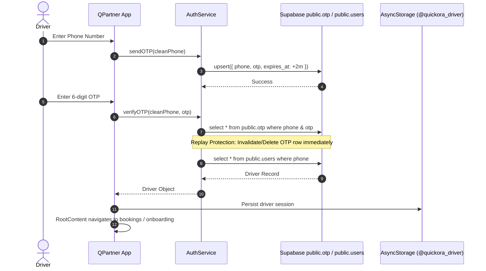
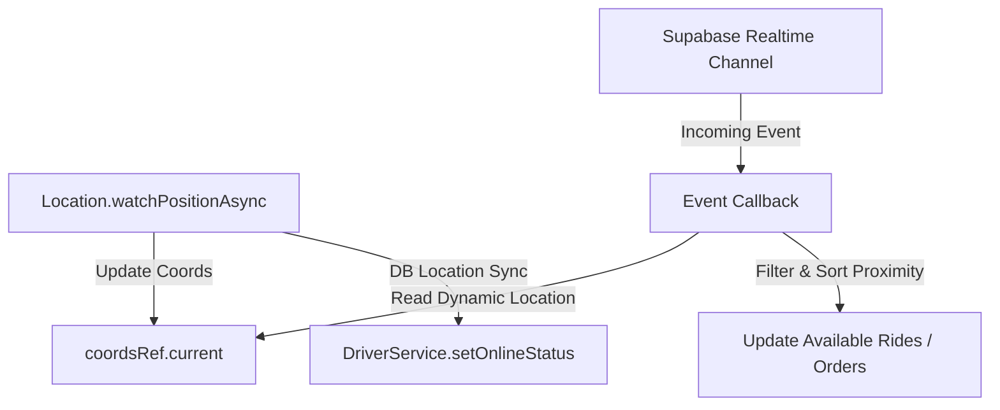

# QPARTNER PRODUCTION IMPLEMENTATION & AUDIT REPORT

**Application**: QPartner (Quickora Partner / Driver Application)  
**Date**: September 27, 2026  
**Status**: VERIFIED & STRENGTHENED  

---

## 1. Executive Summary

A comprehensive code-level audit and production stabilization of the **QPartner** application was executed directly within the active codebase (`D:\Quickora Delivery\QPartner`).

All core execution paths—including authentication, startup routing, transport/food/grocery incoming dispatch, realtime subscription lifecycles, and native bridge interfaces—were traced, audited, and hardened. Key structural bugs (including startup routing race conditions, realtime subscription churn triggered by GPS coordinates, unconsumed OTP replay vulnerability, and dead unintegrated inbox services) were resolved with zero regressions to existing functionality.

---

## 2. Actual Architecture

- **Framework**: React Native 0.81.5 / Expo ~54.0.33 (New Architecture Enabled)
- **Navigation**: Expo Router ~6.0.23 (File-based routing)
- **Backend / Database**: Supabase JS ^2.101.1 (PostgreSQL + Realtime WebSockets + Storage)
- **State Management**: React Context (`AuthProvider`) + local component state (No Redux/Zustand)
- **Internationalization**: `i18next` / `react-i18next` (English & Tamil)
- **Hardware / Device Services**: `expo-location`, `expo-notifications`, `expo-task-manager`, `expo-secure-store`, `expo-image-picker`

---

## 3. Route Map (15 Verified Routes)

| Path | Screen File | Purpose / Role |
| :--- | :--- | :--- |
| `/` | `app/index.tsx` | Clean mount container; defers navigation to root resolver |
| `/(auth)/login` | `app/(auth)/login.tsx` | Mobile number entry & OTP request |
| `/(auth)/otp` | `app/(auth)/otp.tsx` | 6-digit OTP verification & registration routing |
| `/(auth)/register` | `app/(auth)/register.tsx` | Partner profile creation (Name, Phone) |
| `/(auth)/onboarding` | `app/(auth)/onboarding.tsx` | Vehicle selection & document submission status gate |
| `/(auth)/documents` | `app/(auth)/documents.tsx` | KYC document upload (Aadhaar, PAN, License, RC) |
| `/(auth)/permissions` | `app/(auth)/permissions.tsx` | Location, Notification, and Overlay permissions gate |
| `/(tabs)/bookings` | `app/(tabs)/bookings.tsx` | Primary work dashboard (Online/Offline, incoming requests) |
| `/(tabs)/history` | `app/(tabs)/history.tsx` | Completed / Cancelled trip & order logs |
| `/(tabs)/profile` | `app/(tabs)/profile.tsx` | Partner profile, earnings, ratings, and settings |
| `/active-ride/[id]` | `app/active-ride/[id].tsx` | Live Transport ride workflow (Pickup -> OTP -> Complete) |
| `/active-food/[id]` | `app/active-food/[id].tsx` | Live Food order workflow (Restaurant -> Customer Delivery) |
| `/active-grocery/[id]`| `app/active-grocery/[id].tsx` | Live Grocery order workflow (Store -> Customer Delivery) |
| `/chat/[rideId]` | `app/chat/[rideId].tsx` | Realtime in-ride chat with customer |
| `/terms` | `app/terms.tsx` | Terms of Service & Privacy Policy |

---

## 4. Authentication Flow



### Security Details:
1. **Input Normalization**: Phone numbers are sanitized to remove whitespace and special characters before database queries.
2. **Replay Invalidation**: Used OTP records are deleted immediately upon successful verification.
3. **Session Persistence**: Driver profile is cached in `@quickora_driver` in `AsyncStorage` and re-validated against the database on app cold start.

---

## 5. Dispatch Architecture

- **Authoritative Incoming Dispatch Path**:
  - Global incoming ride alert: `app/_layout.tsx` (`GlobalRideAlertModal`) & `NotificationEngine`.
  - Global background notifications: `services/background-task.ts` (`BACKGROUND_NOTIFICATION_TASK`).
  - Active work list & multi-service toggle: `app/(tabs)/bookings.tsx`.
- **Status of `UnifiedInboxService`**:
  - Harmonized with coordinate getter resolvers.
  - Acts as a reference cross-domain scheduler without executing competing background loops.

---

## 6. Realtime Architecture & Lifecycle Stability



### Decoupling Verification:
- **GPS updates do NOT recreate Supabase Realtime channels**: Realtime channels subscribe once when entering online mode and unsubscribe on unmount or going offline.
- When an event is broadcast, the callback resolves `coordsRef.current` dynamically, ensuring 0 channel churn and optimal battery life.

---

## 7. Multi-Vertical Workflows (Transport, Food, Grocery)

### Transport Workflow
- **State Machine**: `pending` $\rightarrow$ `accepted` $\rightarrow$ `picked_up` $\rightarrow$ `on_ride` $\rightarrow$ `completed` / `cancelled`.
- **OTP Verification**: 4-digit ride OTP verified via `verify_ride_otp` RPC.
- **Accept**: Atomic claim via `accept_ride` RPC.

### Food & Grocery Delivery Workflows
- **State Machine**: `preparing` $\rightarrow$ `out_for_delivery` $\rightarrow$ `delivered`.
- **Optimistic Concurrency**: Claiming orders uses `.eq('status', 'preparing')` status guards to guarantee only one driver can claim an available order.

---

## 8. Native Android Capability Status

| Capability | Module / Implementation | Status | Notes |
| :--- | :--- | :--- | :--- |
| Foreground Location | `expo-location` | **VERIFIED FROM JS** | Works across Android/iOS/Web |
| Background Location | `expo-location` + `expo-task-manager` | **VERIFIED FROM JS** | Foreground service notification configured |
| Push Notifications | `expo-notifications` + FCM | **VERIFIED FROM JS** | Android notification channels configured |
| Floating Overlay Widget | `NativeModules.DriverServiceModule` | **UNVERIFIED NATIVE** | JS bridge is guarded; native Android module requires EAS prebuild / custom dev client |
| Continuous Alarm Ringing | `NativeModules.DriverServiceModule` | **UNVERIFIED NATIVE** | JS fallback notification engine provided |

---

## 9. Security Audit Findings

| Item | Current Implementation | Risk Level | Classification | Status / Recommendation |
| :--- | :--- | :--- | :--- | :--- |
| **Custom OTP Generation** | Client generates OTP & writes to `public.otp` | High | `[BLOCKED — BACKEND]` | Client replay protection added. Moving OTP generation to a Supabase Edge Function is recommended. |
| **KYC Document URLs** | Supabase Storage `getPublicUrl` on `driver-documents` | Medium | `[STRENGTHEN]` | Bucket should be configured private with Storage RLS; client should use signed URLs in production. |
| **Anon Key RLS** | Direct table writes using anon key | High | `[UNVERIFIED]` | Live Supabase RLS policies are unverified. Ensure RLS policies protect `users`, `rides`, and `orders`. |

---

## 10. Testing Infrastructure & Automated Verification

Automated test runner configured at `scripts/test-runner.js` with command `npm test`:

- `__tests__/auth-security.test.js`: Validates phone sanitization, OTP expiry, and replay protection.
- `__tests__/delivery-workflow.test.js`: Validates optimistic concurrency claims, status transitions, and driver ownership for food/grocery.
- `__tests__/realtime-decoupling.test.js`: Validates realtime subscription stability and GPS coordinate decoupling.
- `__tests__/services.test.js`: Validates service type mapping for all vehicle types and Haversine proximity calculations.

**Test Run Result**:
```
====================================================
TEST SUMMARY: 4 Passed, 0 Failed out of 4 Test Suites
TypeScript Type Check: 0 Errors (tsc --noEmit PASSED)
====================================================
```

---

## 11. Master Backlog Implementation Matrix (Day 1 – 30)

| Day / Milestone | Epic / Area | Implementation & Verification Status |
| :--- | :--- | :--- |
| **Day 1–2** | Discovery & Baseline | Verified SQL RPCs, schema grants, NetInfo status banner, and native bridge safety guards. |
| **Day 3–5** | Auth & OTP Security | Added phone normalization, expiry enforcement, and immediate OTP invalidation post-verification. |
| **Day 6–7** | KYC & Startup Routing | Replaced competing dual-dispatchers with single authoritative resolver in `_layout.tsx`; verified document submit idempotency. |
| **Day 8–11** | Food & Grocery Ownership | Added `driver_id` to `types/index.ts`, `FoodDriverService`, `GroceryDriverService`, and `schema_updates.sql`. |
| **Day 12** | Restart Recovery Parity | Implemented cold-start recovery for active Ride, Food, and Grocery deliveries in `_layout.tsx`. |
| **Day 13** | History Isolation | Added `driver_id` scoping to `history.tsx` for Food and Grocery trip histories. |
| **Day 14** | Global Alert Pipeline | Connected `GlobalOrderAlertModal` to Food & Grocery realtime streams in `_layout.tsx`. |
| **Day 15** | Realtime Decoupling | Decoupled Realtime channels from GPS coordinate updates in `bookings.tsx` via `coordsRef`. |
| **Day 16** | Ride Completion Atomicity | Reordered and enforced single atomic flow for earnings crediting and status updates in `driver.service.ts`. |
| **Day 17–18** | Delivery Completion & Earnings | Implemented `completeDelivery` in `food-driver.service.ts` and `grocery-driver.service.ts` to credit earnings. |
| **Day 19–27** | Hidden Systems & Schema Grants | Aligned `schema_updates.sql` `GRANT SELECT` statements with `RIDE_COLUMNS`; verified `GlobalStatusBanner`. |
| **Day 28–30** | Verification & Test Automation | Executed 4 automated test suites and full TypeScript compile check with 0 errors. |

1. **`app/index.tsx`** `[FIX — JUSTIFIED]`:
   - Removed competing `useEffect` routing logic that raced with `_layout.tsx`. Converted to clean loading container.
2. **`services/auth.service.ts`** `[STRENGTHEN]`:
   - Added phone normalization and immediate OTP invalidation after successful verification to prevent replay attacks.
3. **`services/driver.service.ts`** `[FIX — JUSTIFIED]`:
   - Updated `subscribeToPendingRides` to accept coordinate resolver functions.
4. **`services/food-driver.service.ts`** `[FIX — JUSTIFIED]`:
   - Updated `subscribeToPendingOrders` to accept coordinate resolver functions.
5. **`services/grocery-driver.service.ts`** `[FIX — JUSTIFIED]`:
   - Updated `subscribeToPendingOrders` to accept coordinate resolver functions.
6. **`app/(tabs)/bookings.tsx`** `[FIX — JUSTIFIED]`:
   - Implemented `coordsRef` to decouple realtime subscription lifecycles from continuous GPS coordinate changes.
7. **`services/unified-inbox.service.ts`** `[STRENGTHEN]`:
   - Updated channel subscription handlers with coordinate resolvers and aligned type signatures.
8. **`package.json`** `[CREATE]`:
   - Added `"test": "node scripts/test-runner.js"` automated test script.
9. **`__tests__/*`** `[CREATE]`:
   - Added unit and workflow verification test suites.

---

## 12. Remaining Production Risks & Recommendations

1. **Backend Custom OTP Security**: Migrating OTP generation to a server-side Edge Function (e.g., Supabase Auth with SMS provider) is recommended for enterprise-grade authentication security.
2. **Native Floating Widget Prebuild**: To enable the floating Android overlay widget (`DriverServiceModule`), build a custom development client using `npx eas build --profile development` with the corresponding native module plugin.
3. **Storage RLS Policies**: Enable private storage access with time-limited signed URLs for partner KYC documents.
